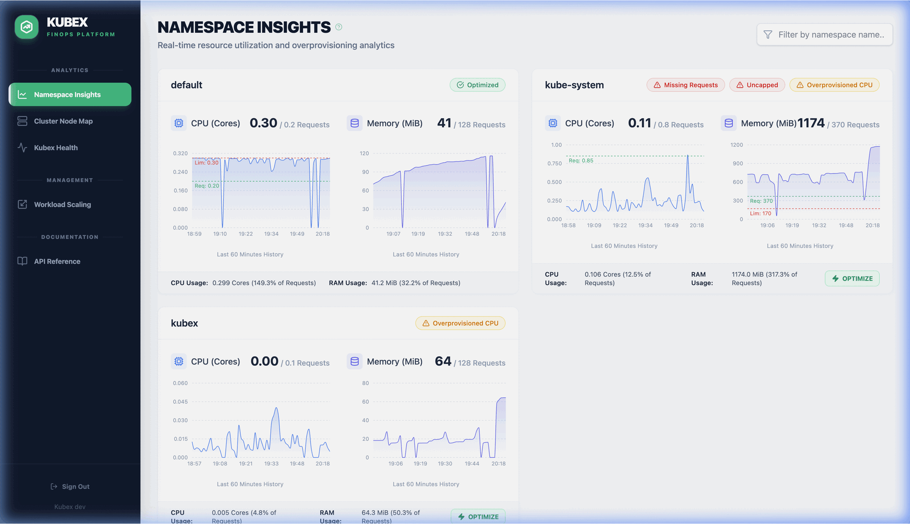

<h1 align="center">Kubex</h1>

<p align="center">
  <strong>Stop wasting money on empty pods. Start optimizing your Kubernetes clusters.</strong>
</p>

<p align="center">
  <a href="https://github.com/migalsp/Kubex/actions/workflows/ci.yml">
    
  </a>
  <a href="https://github.com/migalsp/Kubex/releases">
    
  </a>
  <a href="https://goreportcard.com/report/github.com/migalsp/kubex-operator">
    
  </a>
  <a href="https://opensource.org/licenses/Apache-2.0">
    
  </a>
  <a href="https://app.codecov.io/gh/migalsp/kubex-operator">
    
  </a>

<br />

**Kubex** is a lightweight Kubernetes Operator that automatically cuts cloud costs and simplifies resource management. It finds over-provisioned workloads, scales them down when not in use, and provides a beautiful real-time UI to manage it all.



## Why use Kubex?

Relying on static, guesswork-based CPU and memory limits across hundreds of microservices is a recipe for waste. Developers over-provision "just in case", and cloud bills skyrocket.

**Kubex runs autonomously to fix this:**

- 📉 **Save Money:** Automatically identify namespaces that request too much CPU/Memory and right-size them with a single click.
- ⏰ **Night & Weekend Savings:** Shut down Dev and Staging environments automatically outside of working hours using simple CRDs (`ScalingConfig` & `ScalingGroup`).
- 🗺️ **Visual Capacity Planning:** Instantly see which cluster nodes are burning hot (>90%) and which are sitting empty (<50%).
- 🛡️ **Zero Risk:** Revert optimization changes instantly if a workload underperforms.

## 🚀 Quick Start

Drop Kubex into your cluster in under a minute via Helm:

```bash
helm upgrade --install kubex-operator oci://ghcr.io/migalsp/kubex-operator/charts/kubex-operator --version v1.0.0 -n kubex --create-namespace
```

Open the Dashboard:

```bash
kubectl port-forward svc/kubex-operator 8082:8082 -n kubex
# Go to http://localhost:8082
```

## 📖 Learn More

- [**Installation Guide**](docs/installation.md)
- [**User Guide & Custom Resources**](docs/user-guide.md)

---
If Kubex saves you money, please **⭐️ star this repository!**