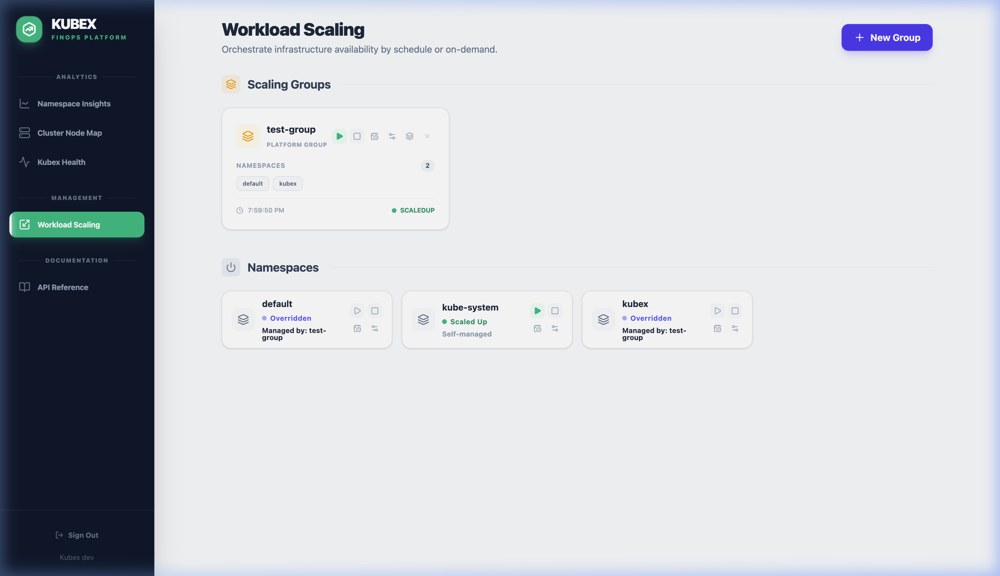
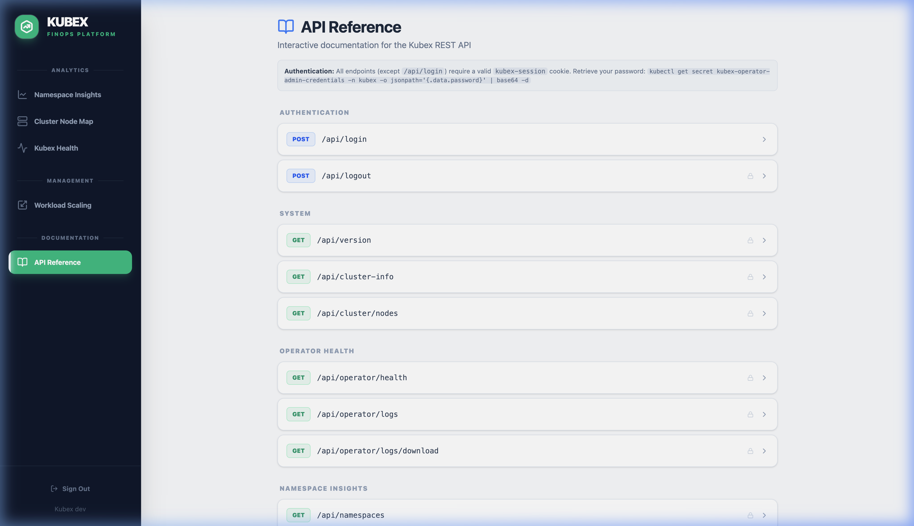

# Kubex Operator

Intelligent FinOps and Resource Optimization for Kubernetes

[](https://goreportcard.com/report/github.com/migalsp/kubex-operator)
[](https://opensource.org/licenses/Apache-2.0)
[](https://github.com/migalsp/kubex-operator/releases)
[](https://app.codecov.io/gh/migalsp/kubex-operator)

## What is Kubex?

**Kubex** is a Kubernetes Operator designed to bridge the gap between cluster management and FinOps. It eliminates resource waste, automates intelligent namespace scaling, and provides a real-time, secure UI to visualize your cluster's resource health.

By continuously analyzing pod metrics and leveraging configurable Custom Resource Definitions, Kubex provides automated, data-driven resource right-sizing and workload scheduling to maintain infrastructure efficiency and reduce operational overhead.

---

## Key Features

### 1. Namespace Insights & Automated Optimization

Kubex constantly monitors real-time CPU and Memory usage across your pods. It automatically identifies **"Overprovisioned"** namespaces where requested resources vastly exceed actual usage, costing you money.

- **One-Click Optimize:** Automatically adjusts Deployment/StatefulSet requests/limits based on a safe margin (e.g., 50% buffer above peak usage).
- **One-Click Revert:** Safely roll back to original configurations if capacity needs suddenly spike.


### 2. Cluster Heatmap Visibility

Get instant, visual feedback on your cluster's infrastructure usage.

- **Heatmap View:** Instantly identify hot nodes (>90% usage) and underutilized cold nodes (<50% usage).
- **Capacity Planning:** Understand exactly how much allocatable CPU and RAM you have left before you need to provision new infrastructure.


### 3. Intelligent Workload Scaling (CRDs)

Automate your environment wake/sleep cycles using powerful Custom Resource Definitions (CRDs). Say goodbye to running Dev/Staging environments on weekends!

- **`ScalingConfig`:** Define Cron-like schedules (e.g., "M-F, 9AM-5PM") for individual namespaces to scale down to zero out of hours.
- **`ScalingGroup`:** Group hundreds of namespaces logically (e.g., `Category: Solution`) and control them centrally from a single CRD.
- **Conflict Resolution:** "Group Wins" logic seamlessly handles overlapping scaling configurations.



### 4. Built-in API & Swagger UI

Kubex provides a secure, fully documented REST API for automation and integration.

- **Local Authentication:** Secure your UI and API with auto-generated session cookies.
- **Swagger UI:** Interactive OpenAPI 3.0 documentation built directly into the platform (`/api/docs`).



---

## Quick Start

Kubex is incredibly easy to adopt. It installs via standard Helm charts and immediately begins providing value.

**1. Add the Helm Repository & Install:**

```bash
helm upgrade --install kubex-operator oci://ghcr.io/migalsp/kubex-operator --version v1.0.0 -n kubex --create-namespace
```

**2. Access the UI Dashboard:**

```bash
kubectl port-forward svc/kubex-operator 8082:8082 -n kubex
# Open http://localhost:8082 in your browser
```

---

## Documentation

For detailed guides on how to unleash the full power of Kubex, explore our comprehensive documentation:

- [**Installation Guide**](docs/installation.md) - For DevOps and Platform Engineers deploying Kubex.
- [**User Guide & Feature Reference**](docs/user-guide.md) - How to configure CRDs, use the UI, and optimize your cluster.

---

## Contributing & Support

We welcome contributions from the community! If you have feature requests, bug reports, or want to contribute code, please check our GitHub Issues.

If this project helps you save money on your Kubernetes clusters, please **⭐️  the repository!**