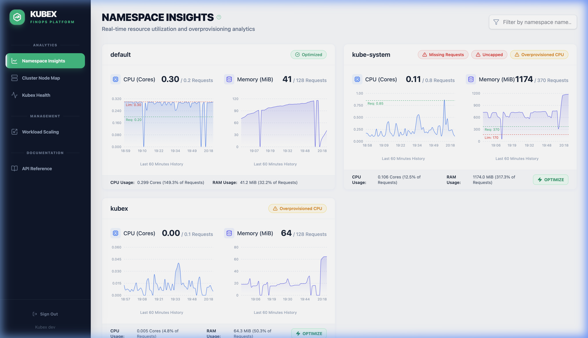
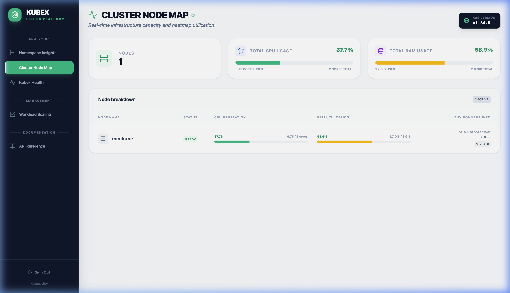

# Kubex User Guide & Feature Reference

Welcome to the **Kubex Operator** user guide. This document explains how to use Kubex's powerful UI dashboard and Custom Resource Definitions (CRDs) to achieve automated FinOps and intelligent environment scaling in your Kubernetes clusters.

---

## Dashboard Navigation

Once installed (see [installation.md](installation.md)), the Kubex UI is your central hub for cluster health. It provides four primary views:

1. **Namespace Insights:** Real-time optimization analytics for applications.
2. **Kubex Health:** Operator self-monitoring and performance metrics.
3. **Workload Scaling:** Manage active/inactive schedules for your environments.
4. **API Reference:** Interactive Swagger UI for the Kubex REST API.

---

## Feature 1: Namespace Optimization

Kubex continuously monitors the actual resource usage (CPU & Memory) of your Pods via the Kubernetes Metrics API.

### The Problem it Solves
Developers often set resource `requests` artificially high "just to be safe." This forces Kubernetes nodes to reserve unneeded capacity, directly inflating your cloud bill by requiring you to provision more nodes.

### The Solution: "Overprovisioned" Detection
In the **Namespace Insights** dashboard, Kubex ranks your applications based on how closely their actual usage matches their requested limits. 

If a namespace is wildly overprovisioned (e.g., requesting 4 Cores but using 0.1 Cores), Kubex flags it in Amber or Red.



#### How to Optimize (The UI Way)
1. Click on an Overprovisioned namespace in the dashboard.
2. Review the historical usage charts versus the flat `Requests` line.
3. Click the green **Optimize** button. 
4. Kubex intercepts the Deployment/StatefulSet and safely lowers the requested requests/limits to match actual usage + a dynamic safety buffer (typically 30-50% above peak).
5. If you need to rollback, click **Revert** at any time.

#### How to Optimize (The GitOps Way)
You can declare an optimization state via CRD.
```yaml
apiVersion: finops.kubex.io/v1
kind: NamespaceOptimization
metadata:
  name: backend-optimization
spec:
  # The target namespace you want to optimize
  targetNamespace: "staging-backend"
```

---

## Feature 2: Cluster Node Map

The **Cluster Node Map** visualizes your underlying infrastructure health at a glance. It translates complex metrics into a simple visual heatmap.



### Heatmap Indicators
- 🟢 **Green (< 50% Usage):** Highly underutilized nodes. You might have too many nodes provisioned.
- 🟡 **Amber (50% - 70% Usage):** Healthy operational capacity.
- 🟠 **Orange (70% - 90% Usage):** Warning zone. The node is filling up.
- 🔴 **Red (> 90% Usage):** Critical capacity. At risk of Pod eviction or CPU throttling.

Below the heatmap, you can see granular metrics detailing `Allocatable` resources vs `Requested` limits vs `Actual Usage`.

---

## Feature 3: Intelligent Workload Scaling

Why pay for Dev or Staging environments over the weekend? Kubex automatically scales down deployments and statefulsets to `0` replicas based on Cron-style schedules, and wakes them back up when needed.

### How to Configure Scaling (The UI Way)
1. Navigate to the **Workload Scaling** tab in the left sidebar.
2. Here you will see a list of all your active scaling configurations and groups.
3. Click on **Create Scaling Group** (or configure an individual namespace).
4. In the modal, define the **Category** name (e.g., "Non-Prod").
5. Select the target namespaces from the dropdown that should belong to this group.
6. Set your active days (e.g., Mon-Fri) and active hours (e.g., 09:00 - 18:00), then specify your timezone.
7. Click **Save**. Kubex will instantly create the underlying CRDs and begin managing the lifecycle of those namespaces.

### Configuration via ScalingConfig (GitOps)
You can configure a schedule for a specific namespace using a `ScalingConfig` object.

```yaml
apiVersion: finops.kubex.io/v1
kind: ScalingConfig
metadata:
  name: team-alpha-dev
spec:
  targetNamespace: "alpha-dev"
  # Set to 'false' to bypass schedules and force the namespace to sleep
  # Set to 'true' to let schedules handle the waking/sleeping
  active: true
  schedules:
    - days: ["Monday", "Tuesday", "Wednesday", "Thursday", "Friday"]
      start: "09:00" # Wake up at 9 AM
      end: "18:00"   # Sleep at 6 PM
      timezone: "Europe/London"
```

### Configuration via ScalingGroup (GitOps)
For large clusters with hundreds of namespaces, managing individual Configs is tedious. Instead, group them by category (e.g., "Non-Prod").

```yaml
apiVersion: finops.kubex.io/v1
kind: ScalingGroup
metadata:
  name: non-prod-environments
spec:
  category: "Non-Prod"
  active: true
  namespaces:
    - "alpha-dev"
    - "beta-dev"
    - "charlie-qa"
  schedules:
    - days: ["Monday", "Tuesday", "Wednesday", "Thursday", "Friday"]
      start: "08:00"
      end: "19:00"
      timezone: "America/New_York"
```

**Conflict Resolution Note:**
If a namespace belongs to a `ScalingGroup`, the Group logic **always** wins. Any individual `ScalingConfig` applied to that namespace will be overridden, and its status will reflect `"OverriddenByGroup"`.

---

## API Automation & Swagger UI

Kubex is built API-first. Anything you can do in the UI, you can do programmatically.

### Authentication

The API is secured using a dynamically generated password stored in a Kubernetes Secret. 

1. **Retrieve your password:**
   ```bash
   kubectl get secret kubex-operator-admin-credentials -n kubex -o jsonpath='{.data.password}' | base64 -d
   ```
2. **Login via API:**
   ```bash
   curl -X POST http://localhost:8082/api/login \
     -H 'Content-Type: application/json' \
     -d '{"username":"kubex-admin", "password":"<your-password>"}'
   ```
   This returns an HTTP-Only `kubex-session` cookie valid for 24 hours. Pass this cookie in subsequent requests.

### API Reference

Explore the full interactive **OpenAPI 3.0 Documentation** by navigating to:
- **In-App:** Click the `API Reference` tab in the the Kubex sidebar.
- **Swagger UI:** Visit `http://localhost:8082/api/docs` in your browser.

---

## Limitations & Best Practices

1. **System Namespaces**: Kubex is hardcoded to **ignore** scaling operations on critical system namespaces (e.g., `kube-system`, `kubex`, `cert-manager`). Do not attempt to optimize or scale the control plane.
2. **Metrics Server Dependency**: If the Kubernetes Metrics Server crashes or goes offline, the UI will degrade gracefully, but Optimization features will be temporarily unavailable until metrics are restored.
3. **Init Containers / Replica Preservation**: If you scale down a Deployment that originally had 3 replicas, when the schedule wakes it back up, Kubex intelligently remembers and restores it to exactly 3 replicas, not 1.
