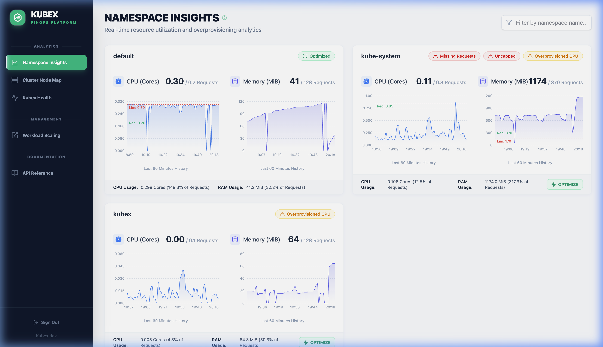
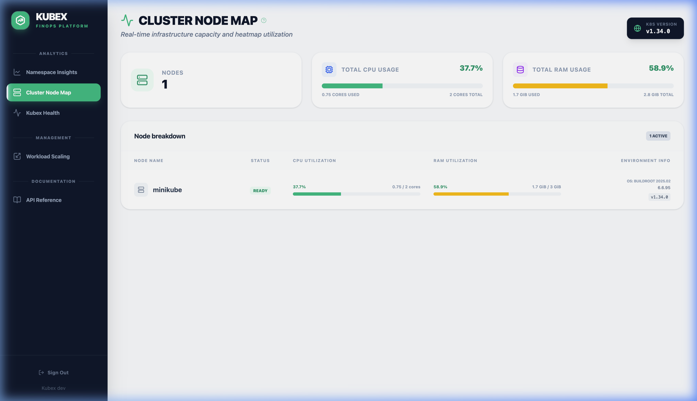

# Kubex User Guide & Feature Reference

Welcome to the **Kubex Operator** user guide. This document explains how to use Kubex's powerful UI dashboard and СRDs to achieve automated FinOps and intelligent environment scaling in your Kubernetes clusters.

---

## Dashboard Navigation

Once installed (see [installation.md](installation.md)), the Kubex UI is your central hub for cluster health. It provides four primary views:

1. **Namespace Insights:** Real-time optimization analytics for applications.
2. **Kubex Health:** Operator self-monitoring and performance metrics.
3. **Workload Scaling:** Manage active/inactive schedules for your environments.
4. **API Reference:** Interactive Swagger UI for the Kubex REST API.

---

## Feature 1: Namespace Optimization

Kubex continuously monitors the actual resource usage (CPU & Memory) of your Pods via the Kubernetes Metrics API.

### The Problem it Solves
Developers often set resource `requests` artificially high "just to be safe." This forces Kubernetes nodes to reserve unneeded capacity, directly inflating your cloud bill by requiring you to provision more nodes.

### The Solution: "Overprovisioned" Detection
In the **Namespace Insights** dashboard, Kubex ranks your applications based on how closely their actual usage matches their requested limits. 

If a namespace is wildly overprovisioned (e.g., requesting 4 Cores but using 0.1 Cores), Kubex flags it in Amber or Red.



#### How to Optimize (The UI Way)
1. Click on an Overprovisioned namespace in the dashboard.
2. Review the historical usage charts versus the flat `Requests` line.
3. Click the green **Optimize** button. 
4. Kubex intercepts the Deployment/StatefulSet and safely lowers the requested requests/limits to match actual usage + a dynamic safety buffer (typically 30-50% above peak).
5. If you need to rollback, click **Revert** at any time.

#### How to Optimize (The GitOps Way)
You can declare an optimization state via CRD.
```yaml
apiVersion: finops.kubex.io/v1
kind: NamespaceOptimization
metadata:
  name: backend-optimization
spec:
  # The target namespace you want to optimize
  targetNamespace: "staging-backend"
```

---

## Feature 2: Cluster Node Map

The **Cluster Node Map** visualizes your underlying infrastructure health at a glance. It translates complex metrics into a simple visual heatmap.



### Heatmap Indicators
- 🟢 **Green (< 50% Usage):** Highly underutilized nodes. You might have too many nodes provisioned.
- 🟡 **Amber (50% - 70% Usage):** Healthy operational capacity.
- 🟠 **Orange (70% - 90% Usage):** Warning zone. The node is filling up.
- 🔴 **Red (> 90% Usage):** Critical capacity. At risk of Pod eviction or CPU throttling.

Below the heatmap, you can see granular metrics detailing `Allocatable` resources vs `Requested` limits vs `Actual Usage`.

---

## Feature 3: Intelligent Workload Scaling

Why pay for Dev or Staging environments over the weekend? Kubex automatically scales down deployments and statefulsets to `0` replicas based on Cron-style schedules, and wakes them back up when needed.

### How to Configure Scaling
1. Navigate to the **Workload Scaling** tab in the left sidebar.
2. Here you will see a list of all your active scaling configurations and groups.

#### Configuring Individual Namespaces

1. Find the target namespace you want to schedule in the **Namespaces** list.
2. Click the **+** (Plus) icon next to it to open the Configuration Modal.
3. Define the active days, active hours, and your specific **Timezone**.
4. Expand the **Namespaces & Stages** section. For an individual namespace, this allows you to define an **Internal Execution Pipeline**. You can group specific pods/microservices inside the namespace into stages to ensure strict boot ordering (e.g., start the local Redis pod before the API pod).
5. Check the **Enable** toggle to activate it.
6. Click **Save**.

*Note: You can instantly manually scale a namespace up or down (bypassing the schedule) by clicking the **Scale Down** or **Scale Up** buttons in the UI.*

#### Creating Scaling Groups & Sequences

For large clusters with hundreds of namespaces, managing individual schedules is tedious. Instead, you can group them and define **Scaling Sequences**.

1. Click the **Create Scaling Group** button at the top of the Workload Scaling dashboard.
2. Define a **Category Name** (e.g., "Non-Prod").
3. Set your active days, active hours, and specify your timezone.
4. Expand the **Namespaces & Stages** section to configure the execution pipeline.
5. **Drag and Drop**: Pick available namespaces and drop them into execution 'Stages'. Applications in the same Stage scale concurrently. Stage 1 must complete fully before Stage 2 begins, ensuring strict boot order (e.g., Databases -> Backend -> Frontend).
6. Click **Save Group**.

#### Scaling 3rd-Party Cloud Databases (AWS Aurora)

Kubex can orchestrate the pausing and resuming of external Managed Cloud Services alongside your Kubernetes cluster workloads, drastically lowering cloud provider bills.

1. Ensure the `aws` provider is enabled in your `values.yaml` (`providers.aws.enabled: true`) with the correct region and IAM credentials/roles. (If `false`, the operator entirely skips AWS discovery and any EC2 IMDS lookups).
2. In the **Namespaces & Stages** pipeline builder, switch the dropdown from 'Namespaces' to 'AWS Aurora Clusters'.
3. Kubex will automatically discover your active RDS/Aurora clusters. Drag and drop these databases into the pipeline (usually as Stage 1 to ensure they are up before your apps boot).

**Hierarchy & Resolution Note:**
If a namespace is managed by a **Scaling Group**, the Group controls **when** the namespace activates or deactivates (the schedule). However, you can still click the `+` button on that namespace to define a `ScalingConfig`. In this scenario, the individual configuration is used strictly to define the **internal pod boot sequence** for that namespace, while deferring the activation schedule to its parent Group.

*(Under the hood, the Kubex dashboard seamlessly creates and updates `ScalingConfig` and `ScalingGroup` Custom Resources on your behalf, eliminating the need to write and apply YAML manifests manually!)*

---

## API Automation & Swagger UI

Kubex is built API-first. Anything you can do in the UI, you can do programmatically.

### Authentication

The API is secured using a dynamically generated password stored in a Kubernetes Secret. 

1. **Retrieve your password:**
   ```bash
   kubectl get secret kubex-operator-admin-credentials -n kubex -o jsonpath='{.data.password}' | base64 -d
   ```
2. **Login via API:**
   ```bash
   curl -X POST http://<kubex-operator-url>:8082/api/login \
     -H 'Content-Type: application/json' \
     -d '{"username":"kubex-admin", "password":"<your-password>"}'
   ```
   This returns an HTTP-Only `kubex-session` cookie valid for 24 hours. Pass this cookie in subsequent requests.

### API Reference

Explore the full interactive **OpenAPI 3.0 Documentation** by navigating to:
- **In-App:** Click the `API Reference` tab in the the Kubex sidebar.
- **Swagger UI:** Visit `http://<kubex-operator-url>:8082/api/docs` in your browser.

---

## Limitations & Best Practices

1. **System Namespaces**: Kubex is hardcoded to **ignore** scaling operations on critical system namespaces (e.g., `kube-system`, `kubex`). Do not attempt to optimize or scale the control plane.
2. **Metrics Server Dependency**: If the Kubernetes Metrics Server crashes or goes offline, the UI will degrade gracefully, but Optimization features will be temporarily unavailable until metrics are restored.
3. **Init Containers / Replica Preservation**: If you scale down a Deployment that originally had 3 replicas, when the schedule wakes it back up, Kubex intelligently remembers and restores it to exactly 3 replicas, not 1.
